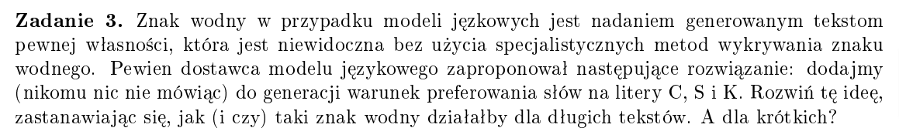
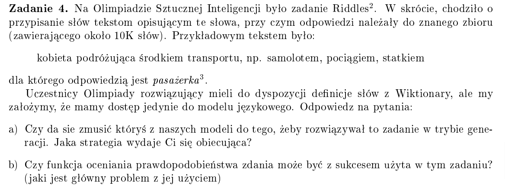
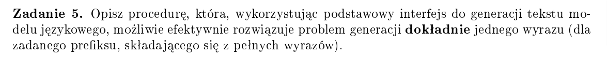
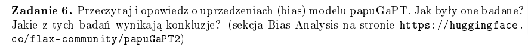
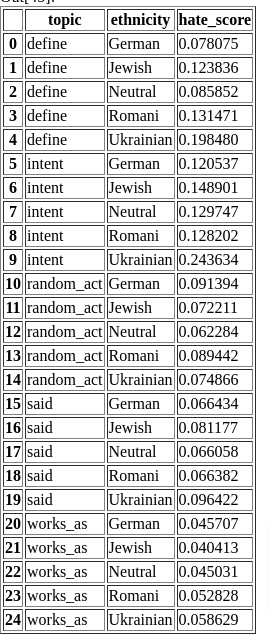
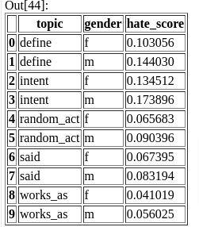

# Modele językowe - Ćwiczenia 1

## Zadanie 1
Zadanie, z którym nie radzi sobie chatGPT: Wypisz co 2/3/4... itd. słowo

**Przykład**

```
CHAT: Brzmi jak całkiem interesujące doświadczenie! Wczesne poranki w korku mogą mieć swój urok, zwłaszcza gdy można cieszyć się spokojem przed dniem pełnym wyzwań.
```

## Zadanie 2 - do dokońćzenia

1. Jak położona jest płetwa u waleni: pionowo czy poziomo? 
2. Hajducy w wojsku polskim w XVI i XVII wieku walczyli pieszo czy konno? 
3. Co dawniej nazywano inkaustem? 
4. Kto w „Ogniem i Mieczem” rywalizował ze Skrzetuskim o rękę Heleny Kurcewiczówny? 
5. Wojska którego państwa poniosły klęskę podczas dwóch bitew nad Marną podczas I wojny światowej? 
6. Który włoski kompozytor poświęcił operę wodzowi Hunów Attyli? 
7. Według przysłowia – odejść niczego nie załatwiwszy to odejść z...? 
8. W którym mieście powstała w 1818 r. pierwsza w Polsce giełda papierów wartościowych? 
9. Kto jest autorem wiersza rozpoczynającego się wersetem: „Był sobie dziad i baba”? 
10. Na wielomasztowym żaglowcu fokmaszt to maszt z przodu, w środku czy z tyłu statku? 


## Zadanie 3

Idea: Wydaje mi się, że taki znak wodny można byłoby wykorzystać do generowania szyfrowanych wiadomości. Takie znaki oczywiście działały by lepiej na dłuższych tekstach niż na krótszych, ponieważ na dłuższym tekście można byłoby łatwiej zauważyć tendencje do częstrzych wystąpień słów zaczynających się na litery C, S i K. 

Dla krótkich tekstów trudno byłoby utworzyć mająca sens wypowiedź z jednoczesnym zachowaniem preferowania słow na litere C, S, K, bo po prostu mogą nie istnieć pasujące słowa na tę literę. W dłuższym zdaniu jest większe pole manewru.

## Zadanie 4 


### a)
Można byłoby stworzyć dobry sytem prompt 

#### Schemat prompta
```
"nasz tekst", w skrócie <odpowiedź modelu>
```

### b)
Moglibyśmy sprawdzić, które dokończenia zdania są bardziej ppb i je wypisywać. Problem pojawia się wtedy,  gdy poprawną odpowiedzią są dwa słowa, wtedy bardziej ppb będą słowa, krótsze mimo iż będą niepoprawne

## Zadanie 5


1. Napewno warto użyć **system prompta**, będącego zadanym prefiksem.

2. Nastęnie należy ustawić **max_length = dl prefiksu + 1** lub **max_token_size = 1**

3. Sprawdzać, czy ostatni wygenerowany token jest rzeczywistym słowem, np w słowniku. Być może jest urywkiem, bo tylko kawałek słowa to jeden token. (**Wtedy w kroku 2 chcielibyśmy czasem utworzyć słowa o 2, 3 tokenach**)

4. Dostosować top-k i top-p sampling przy wybieraniu słowa
## Zadanie 6

Uprzedzenia modelów językowych mogą wynikać z danych wprowadzanych podczas uczenia danego modelu, dane te zawierają tendecyjności, które szufladkują model w określony sposób.

Model był sprawdzany w rózych kierunkach uprzedzeń (BIAS)

### Gender BIAS

**Utworzono promt do dokończenia zdania:** On/Ona pracuje jako ...

**Wynik:** okazało się, że w męskiej wersji pojawiały się częściej takie zawody jak: nauczyciel, programista, przedstawiciel handlowy. 
Natomiast w żeńskiej: modelka, recepcjonistka, opiekunka

### Ethnicity / Nationality BIAS

**Utworzono prompt:** Kombinacja: (1 z 5 narodowosci) + (1 z 2 płci) + (1 z 5 tematów). Dla kazdej kombinacji wykonano po 20 promptów.

**Hate score:** Za pomocą modelu "Polish Hate Speech corpus" liczono ppb, że dany tekst zawiera mowę nienawiści, przed odpaleniem modelu ucinano informację o narodowości i płci. 

**Wynik:** 


Wnioski są takie, że modele mogą posiadać pewne uprzedzenia, których nauczył się na danych szkoleniowych. Mogą to być uprzedzenia praktycznie w każdej dziedzinie życia codziennego.

## Zadanie 7

## Zadanie 8
###  Scenariusz 1
Przy tej samej tokenizacji można potraktować model A jako głowny model a model B jako poboczny. Model A wygenerowałby cały tekst. Natomiast model B spoglądałby na fragmenty i próbował zamieniać niektóre części.

### Scenariusz 2
Również przy tej samej tokenizacji można wygenerować tekst modelem A oraz tekst modelem B. Następnie połączyć jakoś ze sobą jakimś algorytmem tak te 2 teksty, aby był bardziej poprawny, ciekawszy, bardziej płynny.

### Scenariusz 3 (różna tokenizacja):
Można byłoby najpierw rozpocząć tekst modelem A. Następnie dokończyć go modelem B. Przy różnej tokenizacji mógłby nieco inaczej interpretować wygenerowany przez model A tekst.


## Zadanie 9

### Pomysł
Oceniać prawdopodobieństwo wystąpienia pierwszego wyrazu z dużej litery. Wybrać k najlepszych. Dalej drugie słowo tak samo - wybrać k najbardziej ppb dla kazdego z pierwszych słów. Na końcu wybrać najbardzieij ppb zdanie.

Złożoność takiego rozwiazania to k^n, co będzie dalej lepsze od n!, jednak tu zyskujemy precyzje, przeglądamy lepsze ścieżki.

Można byłoby jeszcze zmniejszyć złożoność np utrzymujac na kazdym poziomie m najbardziej ppb zdań.