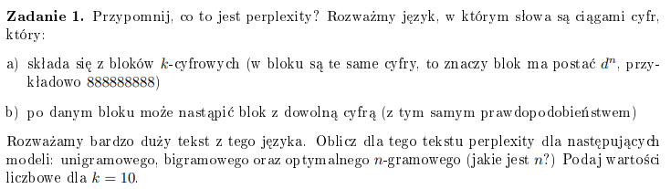
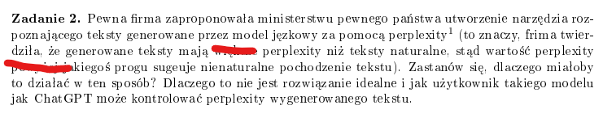
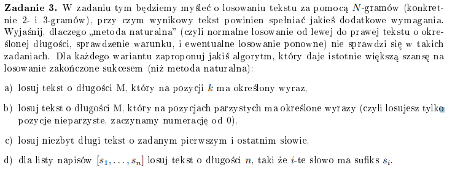
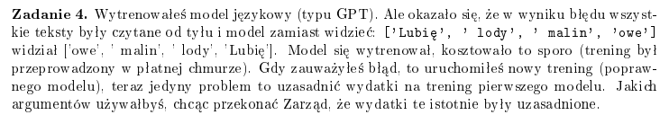
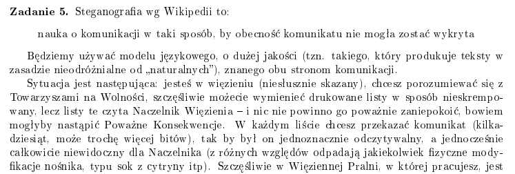
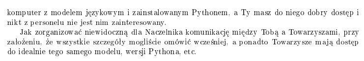
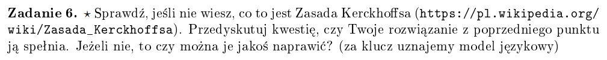
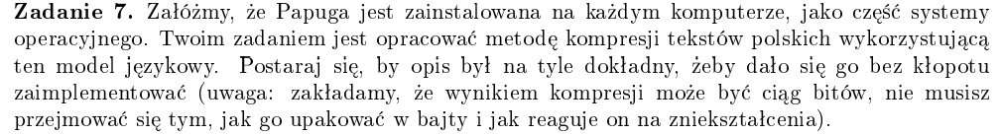

# Zadanie 1


## Definicja
Jest to ppb przewidywania danej sewencji słów ze zbioru znormalizowana przez przez liczbę słów.

**Niskie** perplexity znaczy, że model będzie dobrze radził sobie z przewidywaniem wystąpień kolejnych słów

**Wysokie** perplexity wynik będzie odwroty do **Niskiego** prepexity

Dlatego przy modelach językowych zawsze dążymy do **mninimalizowania** perplexity
## Wzór
$$PP(w_1...w_N) = P(w_1...w_N)^{-\frac{1}{N}}$$
gdzie $N$ to ilość słów

## Specyfikacja
- ```k = 10```
- słówa postaci $d^k$ (np. $88888888$) 
- po danym bloku może wystąpić blok z dowolną cyfrą

## Rozwiązanie

### Model unigramowy

### Model bigramowy

### Model N-gramowy

# Zadanie 2

Pewna Firma zaproponowała ministerstwu pewnego państwa utworzenie narzędzia rozpoznającego teksty generowane przez model jęzkowy za pomocą perplexity
(to znaczy, frima twierdziła, że generowane teksty mają **mniejsze** perplexity niż teksty naturalne, stąd wartość perplexity
**poniżej** jakiegoś progu sugeuje nienaturalne pochodzenie tekstu). Zastanów się, dlaczego miałoby
to działać w ten sposób? Dlaczego to nie jest rozwiązanie idealne i jak

Model, który ma niże perplexity od języka naturalnego może budzić pewne niepewności, ponieważ nie wszystkie teksty pisane są tak samo prawdopodobne. Na przykład kolejne słowa w zdaniach w blogu internetowym będą mniej prawdopodobne niż te w książce kulinarnej, gdzie jest określony schemat budowania zdań. 

Zatem największą wadą niskiego perplexity może być ryzyko powtarzania się słów, szczególnie w bardzo robudowanych zdaniach

# Zadanie 3


## a)
### Metoda naturalna
Jeśli nasze $M$ i $k$ będzie bardzo duże, to ppb, że $k$-ty wyraz spełni wymóg będzie bardzo niskie

W losowaniu od lewej do prawej mamy bardzo ograniczony wpływ na to, co będzie na $k$-tej pozycji

### Lepszy sposób 
W $k$-te miejsce wpisujemy nasz wyraz, powstąną nam w ten sposób dwa fragmenty, które będziemy musieli uzupełnić tekstem. Dla fragmentu $T[0...k-1]$ wypełniamy od prawej do lewej, a dla fragmentu $T[k+1...M]$ wypełniamy od lewej do prawej. 

## b)

### Metoda naturalna - do poprawy
Zaczynamy np. od zerowej pozycji, przy którejś nieprzarzystej pozycji wyraz może się niezgadzać i wtedy będziemy musieli losować od nowa (backtraking), więc będzie trudno wylosować całą sekwencje nieparzystych pozycji.


### Lepszy sposób
Na pozycjach parzystych $i$ losujemy $i+1$ wyraz i sprawdzamy z jakim ppb wypluje wyraz na $i+2$ pozycji, robimy to samo tylko, że $i+1$ jest poprzednikem i sprawdzamy jakie jest ppb dla wyrazu $i$ i bierzemy ten z większym ppb

## c) 

### Metoda naturalna 
Nawet przy niedługi słowie ppb, że przy wyboże słowa $A$, po wygenerowaniu sekwencji słów natrafimy na słowo $B$ jest dosyć niskie

### Lepszy sposób 
Losujemy od lewej do prawej od słowa $A$ i od prawej do lewej od słowa $B$.

#### Dla nieparzystych 
Na pozycji $i$ które nie zostało wylosowane przez żadną ze "ścieżek" wybieramy to bardziej ppb

#### Dla parzystych 
Napierw dla jednej "ścieżki" losujemy pozycje $i+1$, która należy już do prawej "ścieżki" i analogicznie robimy dla prawej "ścieżki" wybieramy tą opcje, która jest bardziej ppb

## d)

### Metoda naturalna
Znowu losując od lewej do prawej nie mamy pewności, że ostatnie wylosowane słowo będzie spłeniało wymagania (bardzo mało ppb)

### Lepszy sposób
Do każdego sufiksu generujemy liste wyrazów, które mogłby do nich pasować 

I idąc od lewej do prawej wybieramy te słowo dla $s_i$, które jest najbardziej ppb

# Zadanie 4

- Utworzyliśmy model, który może być sensowny do analizy tekstów palindromicznych
- Prawdopodobnie rozumie dobrze teksty czytane od prawej do lewej tak jak w języku hebrajskim, arabski i perskim 

# Zadanie 5



- Do zakodowania wiadomości możemy używać synonimów, 
np. **wiatr vs wicher**, gdzie $0$ znaczyło by najbardziej ppb synonim, a $1$ drugi najbardziej albo po prostu inny niż ten najbardziej ppb
- Jeśli długość zdania jest parzysta to koduj $0$ wpp $1$
- Przekonwertować słowo na liczbę binarną, następnie wziąć prefiks i kazać modelowi go dokończyć

# Zadanie 6

- Zasada Kerckhoffsa mówi, że system szyfrujący powinien być bezpieczny nawet wtedy kiedy wszytkie jego szczegóły oprócz klucza są zanane 
- Pierwsze 2 pomysły nie spełniają tej zasady
- Ostatnia spełnia, jeśli napierw zaszyfrujemy nasz napis, a potem będziemy wybierać tokeny

# Zadanie 7

- Do kompresji tekstu użyjemy kodowania Huffmana, czyli tokeny, które występują częściej w tekście będą krótsze, a te co rzadziej dłuższe

## Algorytm 
- Dla każdego tokenu zliczamy jego występowanie 
- Na podstawie częstości występowania tworzymy drzewo Huffmana używając algorytmu Huffmana
- Zastępujemy tokeny kodami Huffmana
- Każdy token otrzymuje swój unikalny kod
- Dekodowanie:
  - Podczas dekompresji Papuga rozpoznaje ciągi bitów jako kody Huffmana i odtwarza odpowiednie tokeny

# Zadanie 8


# Notatki z zajęć
Co to jest ntropia (Machine learning)
piana słowna