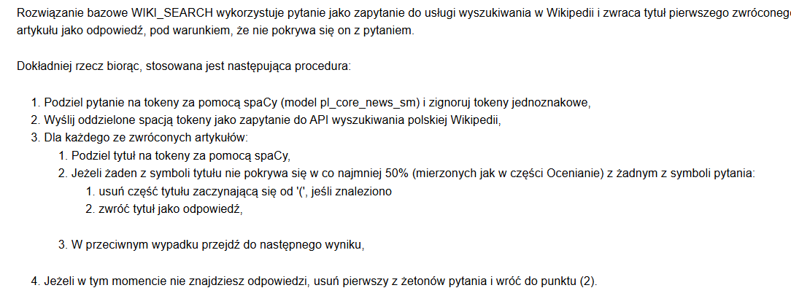
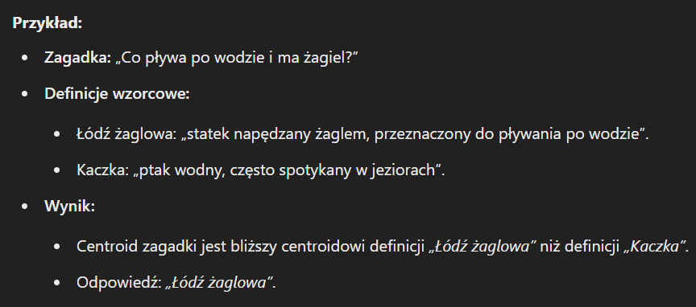
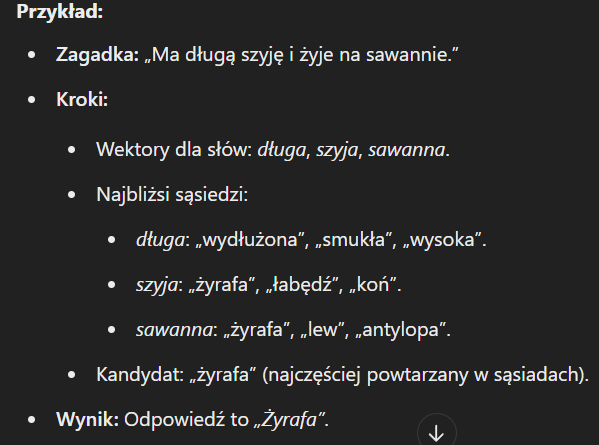

# Deklaracje
|1|2|3|4|5|6|7|8|9|10|11|
|-|-|-|-|-|-|-|-|-|- |- |
|X| X!| X!| X!| | X| |X! | X| | |

# Zadanie 1
**Słowo:** tonie
## Lematy
1. Tonąć
2. Ton (dźwięk wywołany przez drgania akustyczne o tej samej częstotliwości)
3. Toń (głębia wód; obszar wodny, gdzie woda jest głęboka)
4. Tona (1000kg)

## Zadanie 
```
Tonowa lutnia zaczeła tonąć po pewnym tonie.
```

## Chat-4o
```
To zdanie można interpretować jako grę słów, opartą na dźwiękach i ich znaczeniach. "Tonowa lutnia" sugeruje instrument muzyczny, którego istotą jest wydawanie dźwięków (tonów). Fraza "zaczęła tonąć po pewnym tonie" może być metaforyczna i oznaczać, że:

Dosłownie: Lutnia, jako instrument, przestaje brzmieć poprawnie po osiągnięciu konkretnego tonu, być może z powodu defektu, złego nastrojenia lub ograniczeń technicznych.

Symbolicznie: Może to być przenośnia wskazująca na moment, w którym coś pięknego (np. melodia) zaczyna upadać, psuć się lub tracić swoją harmonię.

Poetycko: Gra słów może sugerować płynność muzyki ("tonowa") i wodny motyw ("tonąć"). Może to odzwierciedlać melancholię, zanurzenie w emocjach lub stopniowe zaniknięcie czegoś ulotnego.

Całość ma lekko enigmatyczny, artystyczny wydźwięk i może być interpretowana na różne sposoby w zależności od kontekstu. Co miałeś na myśli?
```
# Zadanie 2


### Krok 4: Utwórz reprezentację klastrów:
Zamiast używać pojedyńczych słów, reprezentuj dokumenty za pomocą przyporządkowań do klastrów i użyj wynikowych centroidów jako cech dokumentu.


### Czym są rzadkie reprezentacje wektorowe słów (wykorzystujące TF-IDF i konteksty)?

**TF-IDF** (Term Frequency Inverse Document Frequency) to metoda oceny ważności słowa w kontekście dokumentu. Wartość TF-IDF rośnie wraz z częstością występowania słowa w dokumencie, ale jest kompensowana przez częstość występowania słowa w całym korpusie dokumentów. W ten sposób TF-IDF pozwala na wykrycie słów, które są unikalne dla danego dokumentu i mają znaczenie w jego kontekście.

Reprezentacja słów w przestrzeni \(n\)-wymiarowej, gdzie \(n\) to moc zbioru słów w danym korpusie. Każde słowo jest reprezentowane jako wektor w tej przestrzeni, gdzie każda współrzędna wektora odpowiada jednemu słowu z korpusu.

---

### Dlaczego nie jest to rozwiązanie perfekcyjne (słaba wskazówka: piękna żaglówka; śliczny żaglowiec)?

- **Brak semantycznego powiązania między synonimami:**  
  Słowa o podobnym znaczeniu, jak *piękna żaglówka* i *śliczny żaglowiec*, mogą mieć bardzo różne reprezentacje wektorowe, ponieważ metoda nie uwzględnia znaczenia ani kontekstu.  
- **Wysoka wymiarowość:**  
  Wektory są bardzo długie, co powoduje duże zapotrzebowanie na pamięć i obliczenia.  
- **Brak różnicowania między lematami:**  
  Różne formy tego samego słowa (np. odmiana przez przypadki) są traktowane jako osobne terminy, co prowadzi do redundancji i mniejszej efektywności.

## Lepsze rozwiązanie 
1. Zastosuj algorytm klasteryzacji do reprezentacji wektorowych słów Word2Vec.
2. Dla każdego klastra oblicz reprezentanta (np. średni wektor).
3. Użyj reprezentantów klastrów jako nowych wektorów słów.
4. Opcjonalnie: zredukuj wymiarowość nowych wektorów za pomocą technik takich jak PCA.
# Zadanie 3
### Zadanie: **Next Sentence Prediction**

Rozważamy zadanie, w którym na wejściu mamy dwa zdania i należy określić, czy są one kolejnymi zdaniami tekstu (czyli czy drugie zdanie jest w tekście bezpośrednio po pierwszym). Zadanie to występuje w dwóch wariantach:

---

#### **a) Przykłady negatywne są losowane z całego korpusu.**
- **Rozwiązanie:**  
  Liczenie prawdopodobieństwa $( P(a|b) )$ vs $( P(b|a) )$, lub:  
  Do pierwszego zdania generujemy jedno lub dwa zdania, po czym doklejamy drugie i liczymy prawdopodobieństwo.

---

#### **b) Przykłady negatywne są kolejnymi zdaniami, w których zmieniliśmy kolejność.**
- **Rozwiązanie:**  
  Liczenie prawdopodobieństwa $( P(a|b) )$ vs $( P(b|a) )$, lub:  
  Za pomocą Word2Vec-a, sprawdzamy odległość między pierwszymi wyrazami drugiego zdania a ostatnimi wyrazami pierwszego zdania i na odwrót.


# Zadanie 4 
1. Reprezentacja Grafu
   - $V$ - użytkownicy
   - $E$ - obejrzane filmy
2. Generowanie ścieżek losowych (Random Walks)
   - Z każdego $v \in V$ generujemy losowe ścieżki w grafie 
   - Każda ścieżka to $v_0, v_1, ..., v_k,$ gdzie $k$ to długość ścieżki 
   - Parametr
3. Traktowanie ścieżek jako zadań 
   - Każda ścieżka jest traktowana jako zdanie z Word2Vec, a każdy węzeł jako słowo. 
4. Trening Word2Vec
    - Wejście: Wezeł z sekwencji
    - Kontekst: Sąsiednie węzły w ścieżce 
5. Wynik 
   - Każdy $v$ ma przypisany wektor osadzeń

# Zadanie 5
# Zadanie 6
## Algorytm 

 
## Dlaczego ma to działać?
1. Na wikipedii są wszytkie odpowiedzi (prawie?)
2. Korzystamy z API, wikipedi, więc zakładmi, że wyszukiwane treści, będą optymalne na danego zapytania
3. Stopniowo redukujemy kolejne tokeny, co sprawia, że jeśli nie znaleśliśmy odpowiedzi, to zaczynamy uogólniać nasze zapytania zwiększając w ten sposób szanse znalezienia odpowiedzi 

## Co można ulepszyć? 
### Użyć Word2Vec
- Zamiast literalnego dopasowania tokenów, można przekształcić pytania oraz tytuły w wektory osadzeń 
- Po polczeniu ppb cosinusowego, zwracamy tutuł o największym ppb 
### Zalety tego 
- Znaczące zmniejszenie czasu wyszukiwania, bo tokeny nie muszą być idealnie dopasowane 
- Ryzyko, złe dopasowanie, ale można poprawić większą ilością testów
# Zadanie 8
## Scenariusz 1: Synonimizacja i parafrazowanie zdań
Opis:
Użyj modelu językowego do generowania parafraz recenzji lub zamiany słów na synonimy, zachowując oryginalny sens.

### Przykład:
- Oryginał: „Film był niesamowity, każda scena trzymała w napięciu.”
- Augmentacja:
„Film był wspaniały, każda scena budziła emocje.”
„Ten film był wyjątkowy, a każda chwila była ekscytująca.”
- Kroki:
  1. Tokenizuj recenzję i identyfikuj kluczowe słowa (np. przymiotniki, czasowniki).
  2. Użyj modelu BERT do generowania synonimów dla wybranych słów lub wygeneruj całą parafrazę za pomocą narzędzi takich jak T5 (przystosowany do parafrazowania).
  3. Sprawdź, czy znaczenie wygenerowanej recenzji jest spójne z oryginałem (np. poprzez obliczenie podobieństwa kosinusowego wektorów osadzeń zdań).
### Zastosowanie:
Zwiększenie różnorodności danych przy zachowaniu ich treści.
## Scenariusz 2: Maskowanie i predykcja wyrazów (Token Replacement)
 - Opis:
Wybierz losowe słowa w recenzji, zamaskuj je, a następnie użyj modelu BERT do przewidzenia alternatywnych słów w ich miejscu.

### Przykład:
#### Oryginał: „Obsada była fantastyczna, a fabuła interesująca.”
#### Augmentacja:
#### Maskowanie: „Obsada była [MASK], a fabuła interesująca.”
Predykcja: „Obsada była znakomita, a fabuła interesująca.”
Inna predykcja: „Obsada była rewelacyjna, a fabuła interesująca.”
#### Kroki:
1. Losowo wybierz 1–2 słowa w zdaniu i zamaskuj je.
Przeprowadź inferencję przy użyciu BERT-a, aby uzupełnić [MASK].
2. Wybierz najbardziej prawdopodobne słowo spośród wyników lub generuj wiele alternatyw.
#### Zastosowanie:
Tworzenie nowych przykładów z minimalnymi zmianami, co pomaga w ogólnej robustności modelu.
## Scenariusz 3: Stylizacja i zmiana tonu recenzji
#### Opis:
Zmodyfikuj ton recenzji (np. od pozytywnego do neutralnego, od neutralnego do negatywnego) za pomocą modelu językowego.

### Przykład:
#### Oryginał: „Restauracja była znakomita, a jedzenie przepyszne!”
#### Augmentacja:
Neutralny: „Restauracja była w porządku, a jedzenie smaczne.”
Negatywny: „Restauracja nie zrobiła na mnie wrażenia, a jedzenie było przeciętne.”
#### Kroki:
1. Analizuj ton recenzji (np. za pomocą klasyfikatora sentymentu).
2. Przy pomocy fine-tuned BERT-a lub innego modelu transformatorowego generuj zdania w innym tonie, bazując na strukturze oryginału.
3. Sprawdź, czy zmodyfikowana recenzja zachowuje ogólny sens.
#### Zastosowanie:
Rozbudowa zbiorów danych do analizy sentymentu w celu zrównoważenia próbek różnych klas (pozytywne/negatywne/neutralne).

# Zadanie 9
## Scenariusz 1 - Word2Vec + Wikipedia
- To samo, co moje ulepszenie w zadaniu 6
## Scenariusz 2 - Dopasowanie zagadki do wzorcowej definicji na podstawie podobieństwa sematycznego 

### Cel - Dopasowanie zagadki do słowa, którego defnicja najlepiej pasuje semantycznie do treści zagadki

### Kroki 
1. Wektoryzacja treści zagadki
- przekształcenie wszystkich słów na Word2Vec
- Oblicz centroid 
2. Wektoryzacja definicji wzorcowych 
- Dla wzorcowych odpowiedzi robimy word2vec
- Obliczamy centroid dla definicji 
1. Liczymy podobieństwo cosinusowe i wybieramy to z największym ppb 

## Scenariusz 3 - Wektoryzacja za pomocą najbliższych sąsiadów 

### Opis 
Znajdujemy OPT słowo na podstawie słów z treści zagadki i ich najbliższych sąsiadów z przestrzeni Word2Vec

### Kroki 
1. Wektoryzacja słów z zagadki 
- Każde słow z zagadki na word2vec 
- ignorujemy (np. „co”, „jest”, „to”).
2. Znajdź najbliższych sąsiadów 
- Dla każdego słowa, znajdź jego top-$k$ najbliższych sąsiadów w Word2Vec
- Zbierz listę słów kadnydatów 
3. Porównanie z wzorcami 
- Dopasuj wybrane słowa-kandydatów do dostępnych definicji wzorcowych 
- Wybierz najbliże słowo, na podstawie centroidu Word2Vec z zagadki 
