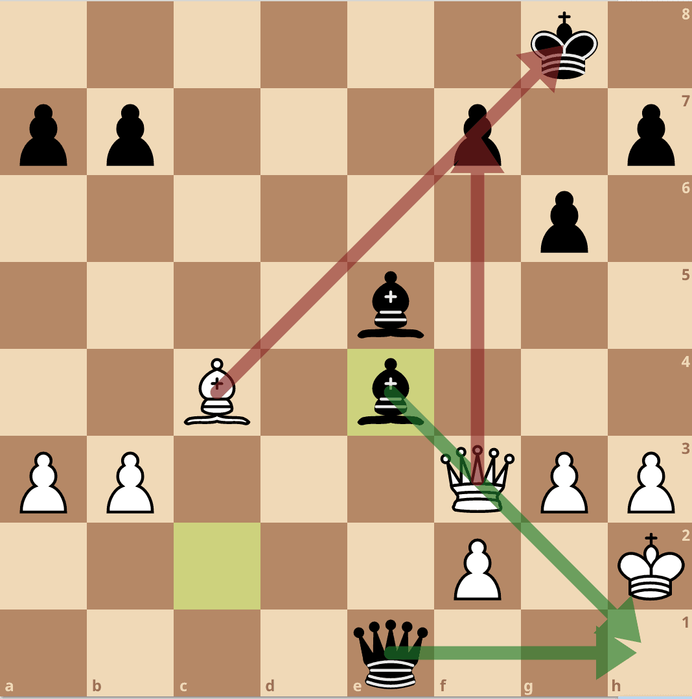
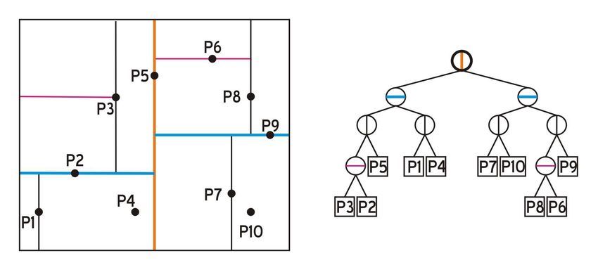

# Zrobione zadania
| Z1  | Z2 | Z3 | Z4 | Z5 | Z6 | Z7 | Z8 | Z9 | Z10 | Z11 |
| -- | -- | -- | -- | -- | -- | -- | -- | -- | -- | -- |
| 1 | 1  | x  | - | x | 1 | - | 1 | 1 | 

## Callout
```
algorytm EEM, DBSCAN, 
przechodnie domknięcie

Wnioski do pracy inżynierskiej, 
Przebadać teren,
Poszukać jeszcze jakiś data setów, spróbować sobie wygenerować za pomocą eleven labs tekst z jakiegoś audiobooka

Fajnym podejściem może być odpalnienie algorytmów dla setu kalgowego (starszego pewnie) i odpalenie dla eleven labs
i porównanie i wyciągnięcie jakiś wniosków. 

Dobrą strategią będzie zapisywanie co się działo podczas wszystkich prób, żeby potem wyciągnąć jakieś wnioski z tego.
```

---

# Zadanie 1

Na pewno robię 
6, 7 - na później
1, 2(podpunkt 1), 4, 5, 8, 9, 10

# Zadanie 1
```
Czym jest null move heuristic? Jakie uzasadnienie ma ta heurystyka, jakie wiążą się z nią
problemy? (wystarczy artykuł na angielskiej Wikipedii, ale oczywiście mile widziane rozszerzenia)
```
## Definicja
Jest to technika heurystki w programach szachowych, która zwiększa prędkość AlfaBeta-pruning

## Idea
Załóżmy, że gramy białmy (czyli maksymalizujemy)
- Mamy jakąś pozycje $P$, zamiast generować kolejne stany, to robimy ruch "zerowy" i otrzymujemy stan $P'$
- Zmieniamy turę, dla białego i robimy, płytkie przeszukiwanie (ok 3)
- Jeśli nasza pozycja jest $\geq \beta$, to mamy tzw. **fail-high** i robimy **cut-off**
- Jeśli nie dostaniemy **fail-high**, to robimy normalne przeszukiwanie


## Problemy 
Problemy pojawiają się, kiedy mamy tzw zugzwang position, czyli bez wiedzy, kogo teraz jest ruch, ciężko jest nam ocenić, kto ma lepszą pozycje.


## Unikanie pewnych sytuacji
- kiedy mamy szach
- Kiedy jedna strona ma króla i pionki
- Kiedy mamy parę figur 
- Kiedy naszym ostatnim ruchem był "null move"

# Zadanie 2
```
Ciekawe ujęcie problemu Sokoban-a przedstawia praca: https://ieee-cog.
org/2020/papers/paper_44.pdf. Zapoznaj się z nią i bądź gotowy opowiedzieć reszcie grupy. Liczbę
punktów (którą wpisujesz w deklaracji) tłumaczymy w następujący sposób (można wpisywać wartości
niecałkowite, jeżeli uważasz, że lepiej oddają stan faktyczny):

    • Przejrzałem dość uważnie całą pracę, rozumiem ogólną ideę, ale być może pewne szczegóły nie
są dla mnie w 100% jasne. (1p)
    • Przeczytałem uważnie całą pracę, sądzę, że umiałbym zaimplementować agenta FESS (2p)
    • Jak wyżej, a dodatkowo rozumiem zasadniczo wszystko z tej pracy i mam pewne pomysły, co
do innych zastosowań przedstawionych w pracy pomysłów, ewentualnie do kontynujacji badań z
pracy (3p)
```

## Idea
Autorzy pokazują FESS(Feature Space Search) - 
nowy algorytm do przeszukiwania przestrzeni stanów dla problemów one-agent-only(np. Sokoban), gdzie zamiast jednej złożonej heurystki używamy wielu pomniejszych 
tzw **feature'rów**

### Działanie 
Dzielimy na 2 przstrzenie 
- DS: Domain Space
- FS: Feature Space

Fess działa cyklicznie:
- Przechodzi po **niepustych komórkach FS**
- Wybiera jedną komórkę **FS**
- Wybiera najlepszy ruch z **DS** odpowiadający tej komórce

1. Czykli zamiast 1 heuryski, rozdzielamy sobie na pare **feature'rów**
    - liczba zapakowynych skrzyń
    - łączność planszy
    - łączność między pokojami 
    - Out-of-plan - liczba skrzy, które w przyszłości mogą zablokować rozwiązanie 
2. Każda cecha tworzy jeden wymiar FS
3. Algorytm przeszukuje tą wielowymiarową przestrzeń
4. Każde przejście może odpowiadać wielu ruchom w **DS** (np. Jeden ruch w FS = wiele ruchów skrzynią)

### Dodatkowe uwagi
- FESS jest komplenty (nie ucina stanów)
- FESS w **DS** korzysta z drzewa
- FESS korzysta z wag (niektóre ruchy mają większe ppb niż inne)

## Wnioski
- FESS nie znajduje optymalnych rozwiązań (średnio ~18% dłuższe), ale znajduje je bardzo szybko

# Zadanie 3
## GRA : BREAKTHROUGH
| Cecha                                            | Opis                                                                  | Dlaczego ważna?                           |
| ------------------------------------------------ | --------------------------------------------------------------------- | ----------------------------------------- |
| 1. Odległość najdalej wysuniętego pionka do celu | Ile pól zostało najbliższemu pionkowi do ostatniego rzędu             | Im bliżej celu, tym lepiej                |
| 2. Liczba pionków                                | Liczba żywych pionków każdego gracza                                  | Przewaga materialna zwiększa kontrolę     |
| 3. Pionki w centrum                              | Liczba pionków w centralnych kolumnach (np. 3–6 na planszy 8x8)       | Lepsza mobilność i kontrola planszy       |
| 4. Pionki chronione                              | Ile pionków ma „osłonę” z tyłu (np. są chronione przez innego pionka) | Chronione pionki są trudniejsze do zbicia |
| 5. Mobilność                                     | Średnia liczba możliwych ruchów na pionka                             | Większa swoboda = lepsza pozycja          |

```
H(state) = 
    w1 * (max_advance_white - max_advance_black) +
    w2 * (num_white - num_black) +
    w3 * (center_white - center_black) +
    w4 * (protected_white - protected_black) +
    w5 * (mobility_white - mobility_black)
```

# Zadanie 4
## KNN
KNN - po prostu puszczamy algorytm, który klasyfikuje na podstawie k najbliższych sąsiadów, jeśli sąsiadów klasy x jest więcej niż innych to taki label dajemy naszemu punktowi

## KD-Trees
Kd-drzewa to struktury danych przypominające drzewa decyzyjne, używane do organizacji punktów w przestrzeniach wielowymiarowych.

Przestrzeń punktową dzieli się **rekurencyjnie i cyklicznie** względem kolejnych wymiarów (np. x, y, z, ...). Na każdym poziomie drzewa wybierany jest jeden wymiar jako kryterium podziału.

Dla danego zestawu punktów:

* wybierany jest **środkowy punkt (mediana)** względem wybranego wymiaru,
* dzieli on przestrzeń na dwie części (np. lewą i prawą względem osi x),
* ten punkt staje się **węzłem drzewa**, a jego dzieci reprezentują odpowiednio lewą i prawą część podzielonej przestrzeni.

Dzięki temu:

* lewe poddrzewo zawiera punkty z mniejszą wartością w danym wymiarze,
* prawe poddrzewo zawiera punkty z większą lub równą wartością.

Proces ten jest powtarzany rekurencyjnie dla każdej części przestrzeni, a wymiary przełączane cyklicznie. Efektem jest zrównoważone drzewo binarne, które pozwala na szybkie operacje przestrzenne, takie jak wyszukiwanie najbliższych sąsiadów czy przeszukiwanie zakresów.



```
function nearest_neighbor(node, target, depth = 0, best = null):
    if node is null:
        return best

    k = number of dimensions
    axis = depth mod k

    # Zaktualizuj najlepszy punkt, jeśli ten jest bliższy
    if best is null or distance(target, node.point) < distance(target, best):
        best = node.point

    # Sprawdź, w którą stronę drzewa iść najpierw
    if target[axis] < node.point[axis]:
        next_branch = node.left
        other_branch = node.right
    else:
        next_branch = node.right
        other_branch = node.left

    # Przeszukaj "bliższą" gałąź
    best = nearest_neighbor(next_branch, target, depth + 1, best)

    # Sprawdź, czy musimy zajrzeć w "dalszą" gałąź
    if abs(target[axis] - node.point[axis]) < distance(target, best):
        best = nearest_neighbor(other_branch, target, depth + 1, best)

    return best


```
# Zadanie 5
1. Dla $k$ > 1
   Kiedy punkt $A$ jest zielony, ale go nie uwzględnimy, ale przez głosowanie zostanie czerwony bo przez głosowanie było 2 cz i 2 z, więc losowo wybraliśmy jako czerw
2. Kiedy k = 1, to zawsze klasyfikujemy jako ten sam kolor                      
3. Kiedy mamy punkt na środku dwóch punktów - to wybierzemy losowo

# Zadanie                                                                                                                