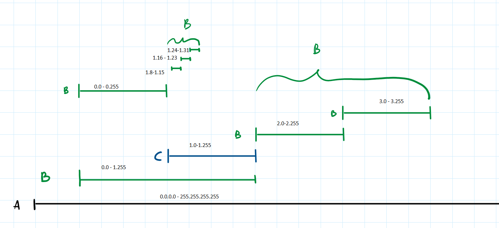

# Zadanie 3

### Zakresy
1. A: `0.0.0.0` - `255.255.255.255`
2. B: `10.0.0.0/23` - `10.0.1.255`
4. B: `10.0.2.0/24 ` - `10.0.2.255`
5. B: `10.0.3.0/24 ` - `10.0.3.255`
6. C: `10.0.1.0/24` - `10.0.1.255/24`
7. B: `10.0.0.128/25` - `10.0.0.255/25`
8. B: `10.0.1.8/29` - `10.0.1.15`
9. B: `10.0.1.16/29` - `10.0.1.23/29`
10. B: `10.0.1.24/29` - `10.0.1.31/29`

### Możemy skleić następujące wpisy
- Od 7 do 9: `10.0.1.8 - 10.0.1.31 = 10.0.1.8/27`
- Od 2 do 4 oraz  6: `10.0.0.0 - 10.0.3.255 = 10.0.0.0/22`

### Nowa tablica routingu

| Posieć | Cel | Początek | Koniec |
| -------- | -------- | -------- | -----|
| `0.0.0.0`    | A    | `0.0.0.0`   | `255.255.255.255`|
|`10.0.0.0/22` | B | `10.0.0.0` | `10.0.3.255` |
|`10.0.1.0/24` | C | `10.0.1.0` | `10.0.1.255` |
|`10.0.1.8/27`| B | `10.0.1.8` | `10.0.1.31` |