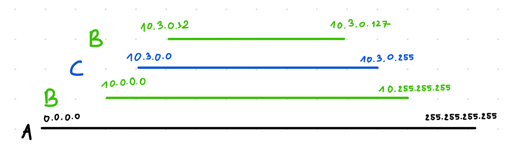
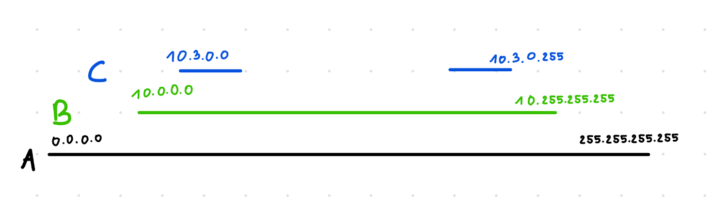

# Zadanie 4
                  
### Zakresy routingów
1. `0.0.0.0/0`: `0.0.0.0` - `255.255.255.255`
2. `10.0.0.0/8`: `10.0.0.0` - `10.255.255.255`
3. `10.3.0.0/24`: `10.3.0.0` - `10.3.0.255`
4. `10.3.0.32/27`: `10.3.0.32` - `10.3.0.63`
5. `10.3.0.64/27`: `10.3.0.64` - `10.3.0.95`
6. `10.3.0.96/27`: `10.3.0.96` - `10.3.0.127`

- Patrząc na rysunek, widzimy, że możemy stworzyć równoważną tablicę routingu, eliminując wpisy 4-6
- Wpis 3 możemy rozdzielić na dwa zakresy:
    1. `10.3.0.0 - 10.3.0.31 = 10.3.0.0/27`
    2. `10.3.0.128 - 10.3.0.255 = 10.3.0.128/25`
- Dzięki temu możemy uprościć wszystkie wpisy dotyczące B, zastępując je jednym, szerokim zakresem `10.0.0.0 - 10.255.255.255 (10.0.0.0/8)`, a następnie dodać dwie bardziej szczegółowe podsieci C, które będą miały pierwszeństwo nad B.

### Otrzymana tablica routingu

| Podsieć | Cel | 
| -------- | -------- | 
| `0.0.0.0/8`     | A     | 
| `10.0.0.0/8 `   |  B |
| `10.3.0.0/27` | C | 
| `10.3.0.128/25` | C |