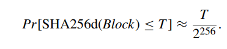
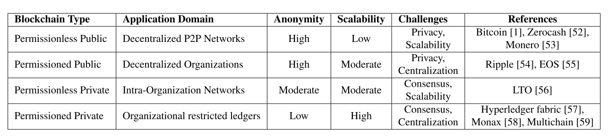

# Notatki z Paperka oraz przemyślenia do prezentacji
- pokazać pseduokod z budowania merkle tree oraz merkle proof

- bitcoin używa podwójnego haszowania sha256
$$SHA256d(message) = SHA256(SHA256(message))$$

BLockchain używa P2P network 
każdy node jest równy 
Tworzony jest graf, który nie jest spójny 

Tworzenie nowych kontaktów 
flooding and random walk are used to make new connections
with the peers

in unstructured grarph peers can leave and joiin any time 

Types of blockchains 
Permissionless Public
Permissioned Public:
Permissionless Private
Permissioned Private

## Wyzwania blockchaina 
- security 
- scalability 
- Forking 